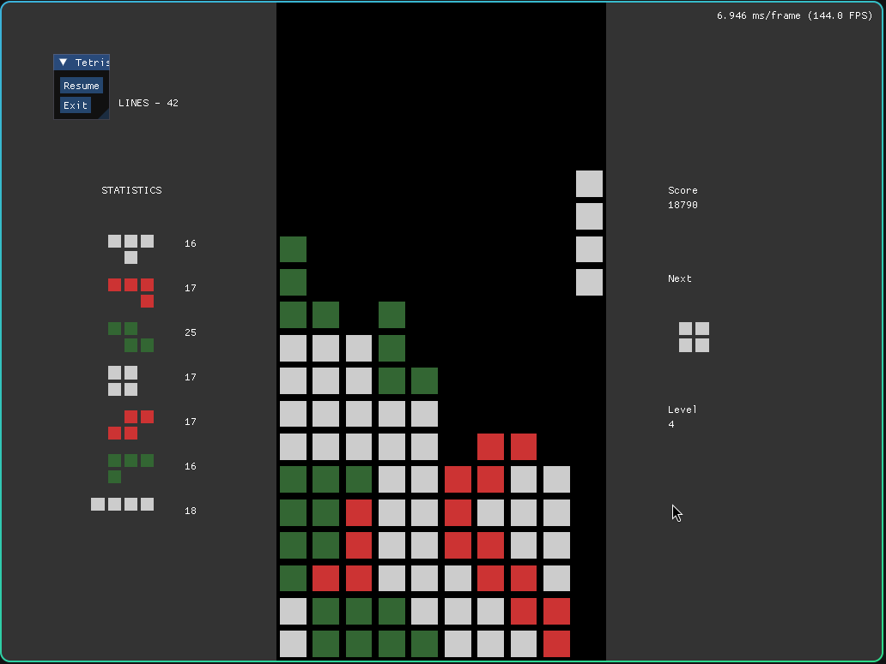

# fsarcade
Games: Tetris, Snake

## Usage on Linux
./compile.sh\
./fsarcade

## Controls
General:
- Escape: toggle pause menu during a game

Tetris:
- Arrow Keys: move left/right
- z, x: rotate

Snake:
- Arrow Keys: move up/down/right/left

## Picture

  

